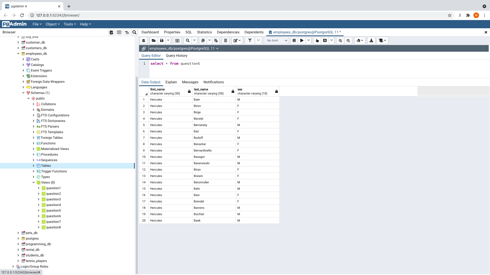

# Employee-Data-Analysis
Utilization of SQL to explore employee data
This repository started out with numerous different csv's that contained past employee data from a company. The csv's were then imported into different tables in a SQL database. Following this, an ERD was constructed in order to visualize and make sense of how the different tables relate to one another. Following this, various queries were run to answer questions about the data. These queries include ...

(Below each query is an example image of what the query would look like if it were to be performed with sql)

1)List the following details of each employee: employee number, last name, first name, sex, and salary.

2) List first name, last name, and hire date for employees who were hired in 1986.

3) List the manager of each department with the following information: department number, department name, the manager's employee number, last name, first name.

4) List the department of each employee with the following information: employee number, last name, first name, and department name.

5) List first name, last name, and sex for employees whose first name is "Hercules" and last names begin with "B."

6) List all employees in the Sales department, including their employee number, last name, first name, and department name.

7) List all employees in the Sales and Development departments, including their employee number, last name, first name, and department name.

8) In descending order, list the frequency count of employee last names, i.e., how many employees share each last name.

